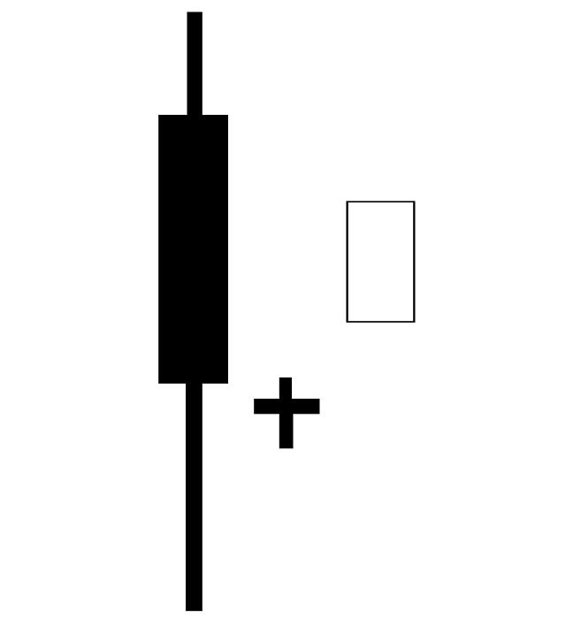

Traderbot
==========
*A trading bot for traders.*

Documentation |docs_badge|
-------------

.. |docs_badge| image:: https://readthedocs.org/projects/traderbot/badge/?version=latest
    :target: http://traderbot.readthedocs.io/en/latest/?badge=latest
    :alt: Documentation Status

You can find all documentation relating to this project `here <https://traderbot.readthedocs.io/en/latest/>`_.

Community
----------
Join us on Discord `here <https://discord.gg/znCASFC>`_.

.. image:: https://raw.githubusercontent.com/discordapp/discord-api-docs/master/images/API_center.gif

Important Notice
-----------------

  Copyright 2017 Jordan Dworaczyk

  Licensed under the Apache License, Version 2.0 (the "License");
  you may not use this file except in compliance with the License.
  You may obtain a copy of the License at

  http://www.apache.org/licenses/LICENSE-2.0

  Unless required by applicable law or agreed to in writing, software
  distributed under the License is distributed on an **"AS IS" BASIS,
  WITHOUT WARRANTIES OR CONDITIONS OF ANY KIND**, either express or implied.
  See the License for the specific language governing permissions and
  limitations under the License.
