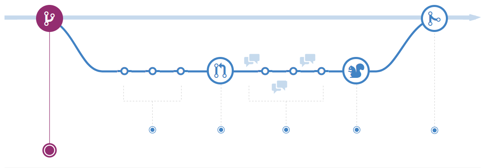

Contributing to Traderbot
=========================
The following is a set of instructions for contributing to Traderbot and its
packages. These are mostly guidelines, not rules. Use your best judgment, and
feel free to propose changes to this document in a pull request.

.. note::
  This project and everyone participating in it is governed by the `Traderbot
  Code of Conduct <https://github.com/JordanDworaczyk/Traderbot/blob/master/docs/CODE_OF_CONDUCT.rst>`_. By participating, you are expected
  to uphold this code. Please report unacceptable behavior to
  jordan.dwo@gmail.com.

How can I contribute?
---------------------
You can contribute by reporting bugs, suggesting enhancements, and submitting your own code using Pull Requests.

Reporting Bugs
^^^^^^^^^^^^^^
It is encouraged that you submit an issue if you find a bug. Do your best to provide as much information as you
can so that people can recreate the bug that you experienced. Don't forget to
mention the version of the bot that you are using, as well as, the system that
you are using to run the bot. If there is an error message displayed, then include the error messagge in your submission. 

.. warning:: **Remove any sensitive information** from the screenshots in your bug report. Sensitive info
  may include things like your API Keys, passwords, or acount balances.

Suggesting Enhancements
^^^^^^^^^^^^^^^^^^^^^^^
Please submit an issue if you would like to suggest an enhancement. When submitting your suggestion, try to follow
the *user story* convention often found in Agile software development. 

User stories are short, simple descriptions of a feature told from the
perspective of the person who desires the new capability, usually a user or
customer of the system. They typically follow a simple template::

  As a <type of user>, I want <some goal> so that <some reason>.

User stories are often written on index cards or sticky notes, stored in a
shoe box, and arranged on walls or tables to facilitate planning and
discussion. As such, they strongly shift the focus from writing about
features to discussing them. In fact, these discussions are more important
than whatever text is written. [1]_

Workflow
^^^^^^^^^^^^^
The Traderbot project implements a standard GitHub workflow, known as *GitHub Flow*, we hope to attract more contributors to the 
community due to its simple and easy to understand nature. [2]_

----

.. seealso:: GitHub Flow. `Understanding the GitHub Flow | GitHubGuides <https://guides.github.com/introduction/flow/>`_

Pull Requests
~~~~~~~~~~~~~
When submitting a Pull Request make sure you: 

* Fill in the required `template <https://github.com/JordanDworaczyk/Traderbot/blob/master/docs/PULL_REQUEST_TEMPLATE.md>`_.
* Do not include issue numbers in the PR title
* Include screenshots and animated GIFs in your pull request whenever possible.
* Follow the `Styleguides`_

Styleguides
-----------
Please mantain the following python and docsting styleguides in order to facilitate easy communication among 
contributers and to properly document source code. 

Python
^^^^^^^^^^^^
All python code must adhere to the `PEP 8 -- Style Guide for Python Code <https://www.python.org/dev/peps/pep-0008/>`_. 

You may use the following ``pep8_cheatsheet.py`` as a guide::
  
  #! /usr/bin/env python
  # -*- coding: utf-8 -*-
  """This module's docstring summary line.
  
  This is a multi-line docstring. Paragraphs are separated with blank lines.
  Lines conform to 79-column limit.
  
  Module and packages names should be short, lower_case_with_underscores.
  Notice that this in not PEP8-cheatsheet.py
  
  Seriously, use flake8. Atom.io with https://atom.io/packages/linter-flake8
  is awesome!
  
  See http://www.python.org/dev/peps/pep-0008/ for more PEP-8 details
  """

  import os  # STD lib imports first
  import sys  # alphabetical

  import some_third_party_lib  # 3rd party stuff next
  import some_third_party_other_lib  # alphabetical

  import local_stuff  # local stuff last
  import more_local_stuff
  import dont_import_two, modules_in_one_line  # IMPORTANT!
  from pyflakes_cannot_handle import *  # and there are other reasons it should be avoided # noqa
  # Using # noqa in the line above avoids flake8 warnings about line length!

  _a_global_var = 2  # so it won't get imported by 'from foo import *'
  _b_global_var = 3

  A_CONSTANT = 'ugh.'

  # 2 empty lines between top-level funcs + classes
  def naming_convention():
      """Write docstrings for ALL public classes, funcs and methods.
      Functions use snake_case.
      """
      if x == 4:  # x is blue <== USEFUL 1-liner comment (2 spaces before #)
          x, y = y, x  # inverse x and y <== USELESS COMMENT (1 space after #)
      c = (a + b) * (a - b)  # operator spacing should improve readability.
      dict['key'] = dict[0] = {'x': 2, 'cat': 'not a dog'}

  class NamingConvention(object):
      """First line of a docstring is short and next to the quotes.
      Class and exception names are CapWords.
      Closing quotes are on their own line
      """

      a = 2
      b = 4
      _internal_variable = 3
      class_ = 'foo'  # trailing underscore to avoid conflict with builtin

      # this will trigger name mangling to further discourage use from outside
      # this is also very useful if you intend your class to be subclassed, and
      # the children might also use the same var name for something else; e.g.
      # for simple variables like 'a' above. Name mangling will ensure that
      # *your* a and the children's a will not collide.
      __internal_var = 4

      # NEVER use double leading and trailing underscores for your own names
      __nooooooodontdoit__ = 0

      # don't call anything (because some fonts are hard to distiguish):
      l = 1
      O = 2
      I = 3

      # some examples of how to wrap code to conform to 79-columns limit:
      def __init__(self, width, height,
                   color='black', emphasis=None, highlight=0):
          if width == 0 and height == 0 and \
             color == 'red' and emphasis == 'strong' or \
             highlight > 100:
              raise ValueError('sorry, you lose')
          if width == 0 and height == 0 and (color == 'red' or
                                             emphasis is None):
              raise ValueError("I don't think so -- values are %s, %s" %
                               (width, height))
          Blob.__init__(self, width, height,
                        color, emphasis, highlight)

      # empty lines within method to enhance readability; no set rule
      short_foo_dict = {'loooooooooooooooooooong_element_name': 'cat',
                        'other_element': 'dog'}

      long_foo_dict_with_many_elements = {
          'foo': 'cat',
          'bar': 'dog'
      }

      # 1 empty line between in-class def'ns
      def foo_method(self, x, y=None):
          """Method and function names are lower_case_with_underscores.
          Always use self as first arg.
          """
          pass

      @classmethod
      def bar(cls):
          """Use cls!"""
          pass

  # a 79-char ruler:
  # 34567891123456789212345678931234567894123456789512345678961234567897123456789

  """
  Common naming convention names:
  snake_case
  MACRO_CASE
  camelCase
  CapWords
  """

  # Newline at end of file
  
.. note:: 
  ``pep8_cheatsheet.py`` is a GitHub Gist.  `See full example | by Richard Bronosky <https://gist.github.com/RichardBronosky/454964087739a449da04>`_
Docstrings
^^^^^^^^^^^^^^^^^^^
Documentation is automatically generated from Python docstrings using Read the Docs, Sphinx, and Napoleon. Therefore, to properly
document code please adhere to either the Google Style or NumPy Style of writing Python docstrings. 

Google Style::

  def func(arg1, arg2):
    """Summary line.

    Extended description of function.

    Args:
        arg1 (int): Description of arg1
        arg2 (str): Description of arg2

    Returns:
        bool: Description of return value

    """
    return True

Numpy style::

  def func(arg1, arg2):
      """Summary line.

      Extended description of function.

      Parameters
      ----------
      arg1 : int
          Description of arg1
      arg2 : str
          Description of arg2

      Returns
      -------
      bool
          Description of return value

      """
      return True
    
.. seealso::
  * `Complete Example of Google Style Docstrings <https://sphinxcontrib-napoleon.readthedocs.io/en/latest/example_google.html#example-google>`_ 
  * `Complete Example of NumPy Style Docstrings <https://sphinxcontrib-napoleon.readthedocs.io/en/latest/example_numpy.html#example-numpy>`_

----

.. rubric:: Footnotes

.. [1] User stories are part of an agile approach that helps shift the focus from writing about requirements to talking about them. All agile user stories include a written sentence or two and, more importantly, a series of conversations about the desired functionality. `Read more about User Stories | MountainGoateSoftware <https://www.mountaingoatsoftware.com/agile/user-stories>`_

.. [2] GitHub Flow is a lightweight, branch-based workflow that supports teams and projects where deployments are made regularly. This guide explains how and why GitHub Flow works.  `Read more about GitHub Flow | GitHubGuides <https://guides.github.com/introduction/flow/>`_
